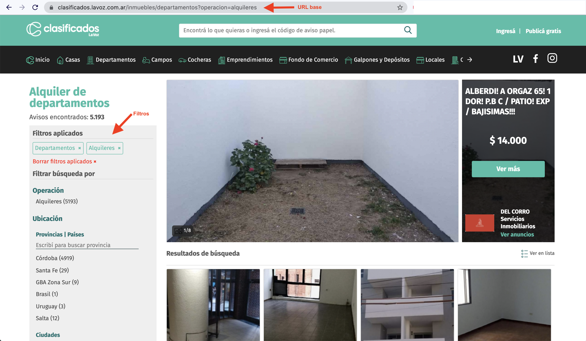

# LaVoz scraper

## URL base

El scraper precisa de un URL base desde el cual comenzar a correr. Para ello, ir a la [página base](https://clasificados.lavoz.com.ar/inmuebles/todo), seleccionar los filtros que se desean en la sidebar y, al finalizar esto, copiar la URL que será la que servirá de base.



## Ejecutar

```bash
# Build
docker build -t lavoz .

# Run
docker run -it -v `pwd`:'/app' lavoz

# Build and run
docker build -t lavoz . && docker run -it -v `pwd`:'/app' lavoz
```
